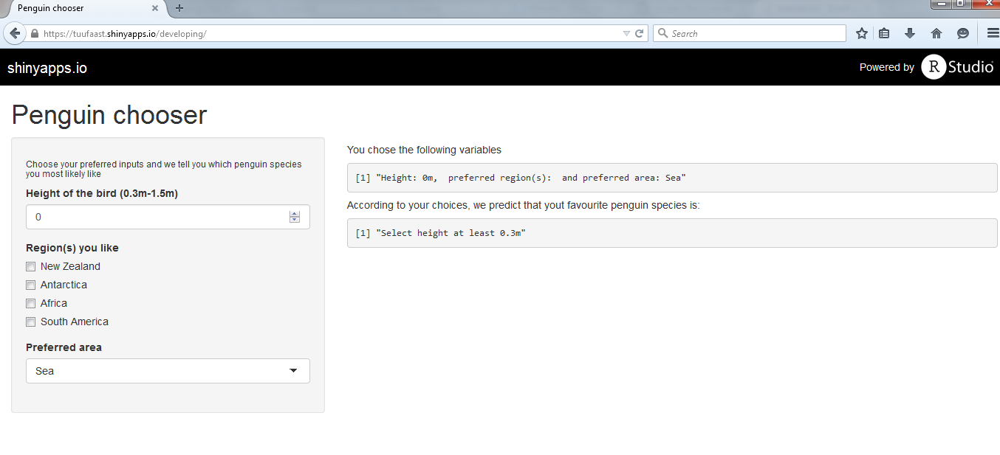
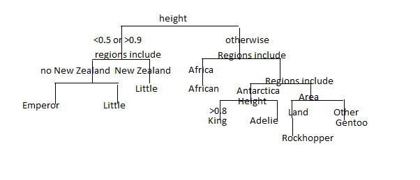

## Penguin app

We have developed an app that predicts, which penguin you'd prefer based on the parameters you choose on the app page. 


There are 7 different species that can be output 

* Little penguin
* Emperor penguin
* African penguin
* King penguin
* Adelie pengion
* Gentoo penguin
* Rockhopper penguin


--- .class #id 

## Screenshot of the app



--- .cover #FitToHeight


## Input parameters

In the app the height, region(s) and area is chosen and based on this, the predicition is made. The choises of the parameters are the following: 

1. Height
  * numeric value between 0.3-1.5m, increments possible by 0.1
  * reguired input to be set, otherwise one does not get the rediction result
2. Region(s)
  * optional
  * can select many regions
  * Choises are: New Zealand, Antarctica, Africa, Sout America
3. Area
  * Selection of following: Sea, Land, Glacier
  * Default value Sea

---  .class #id 

## Algorithm behind the app

The decision tree algorithm behind the app is shown in the following figure.



Additionally, we wait that the number of people finding our apps useful is: 


```r
ceiling(runif(1)*50)
```

```
## [1] 39
```

